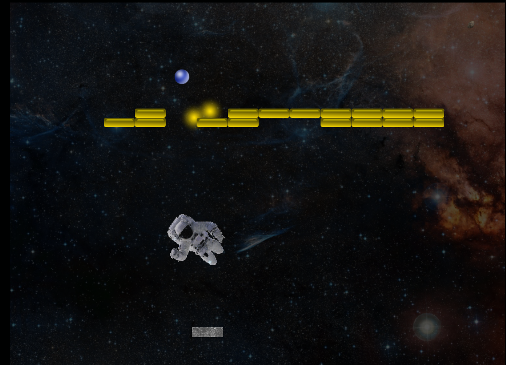
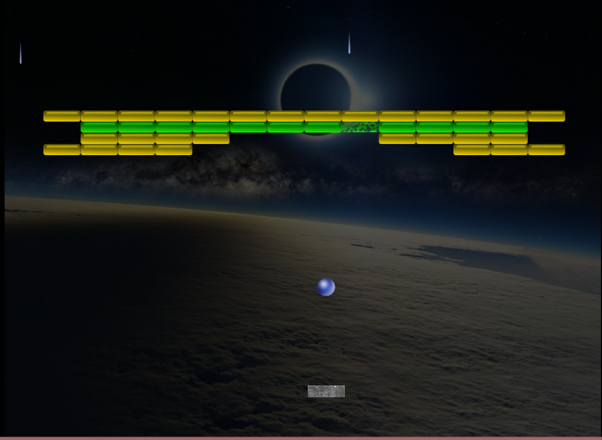
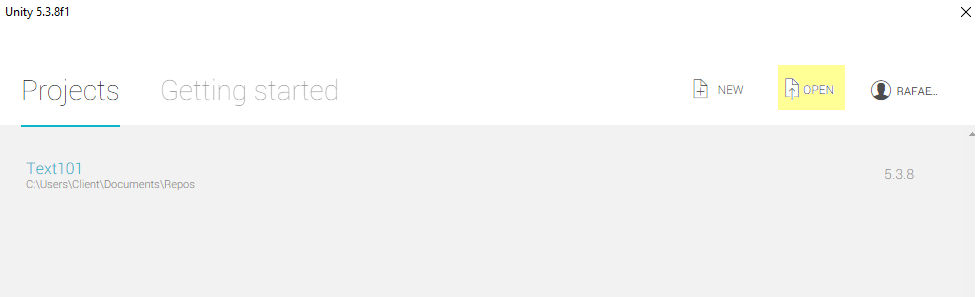

# Space Breaker
> A copy of the classical Block Breaker

Created using [Unity](https://unity3d.com)

Never forget the classics! In this version of Block Breaker the player is meat to destroy the blocks while in the space. Objects falls from the space like meteorites, comets and others. Even a Meteor and an astronaut flying through the sky are your mates in this adventure!

Once the game is still in development, there are some images not proper to the Space. Soon new versions will come with proper evolution on gameplay.

## Installation

The installation of this project is a straight forward one. Simply install Unity3D

Open Unity3D and then click on open, and choose the folder where the repository was downloaded

From there you are able to build a playable version or make any changes you might consider as proper.

## Usage example

Manual for usage is still in development.

## Release History

* Test
  * This is a Test version. Details about releases will be here soon.

## Meta

Rafael Costa 
* [@rafaelcostatech](https://twitter.com/@rafaelcostatech)
* rafael@rafaelcostatech.com
* http://rafaelcostatech.com/

## Contributing
	The contribution manual is in development and shall be here soon

1. Fork it (https://github.com/rafaelcostatech/Space-Breaker)
2. Create your feature branch (`git checkout -b feature/fooBar`)
3. Commit your changes (`git commit -am 'Add some fooBar'`)
4. Push to the branch (`git push origin feature/fooBar`)
5. Create a new Pull Request

